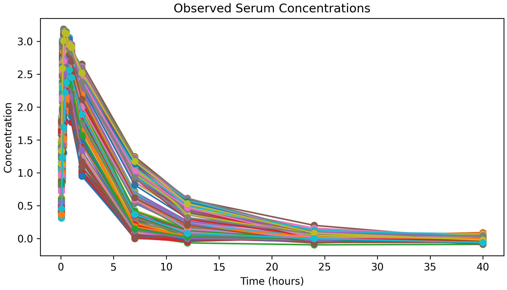
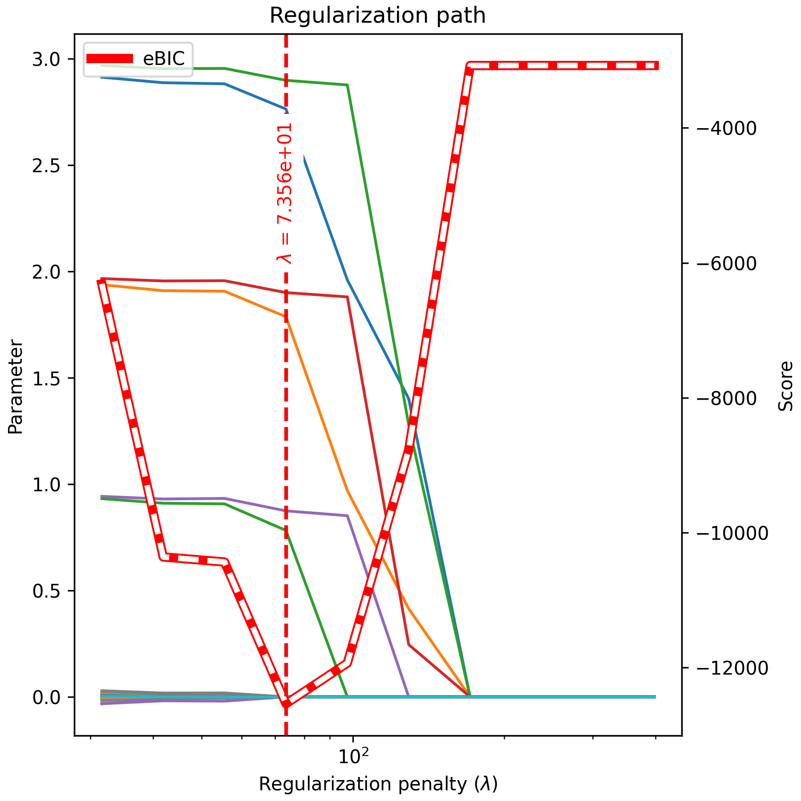
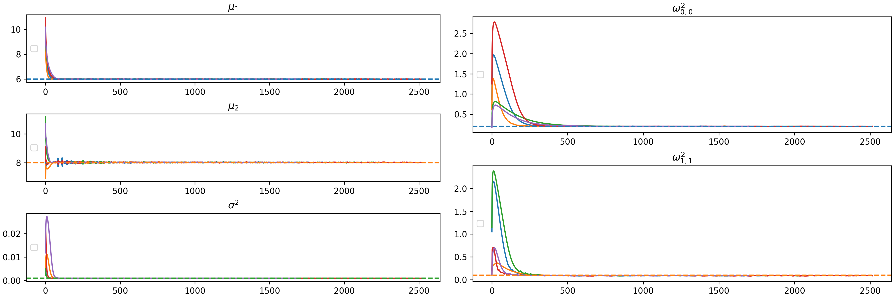
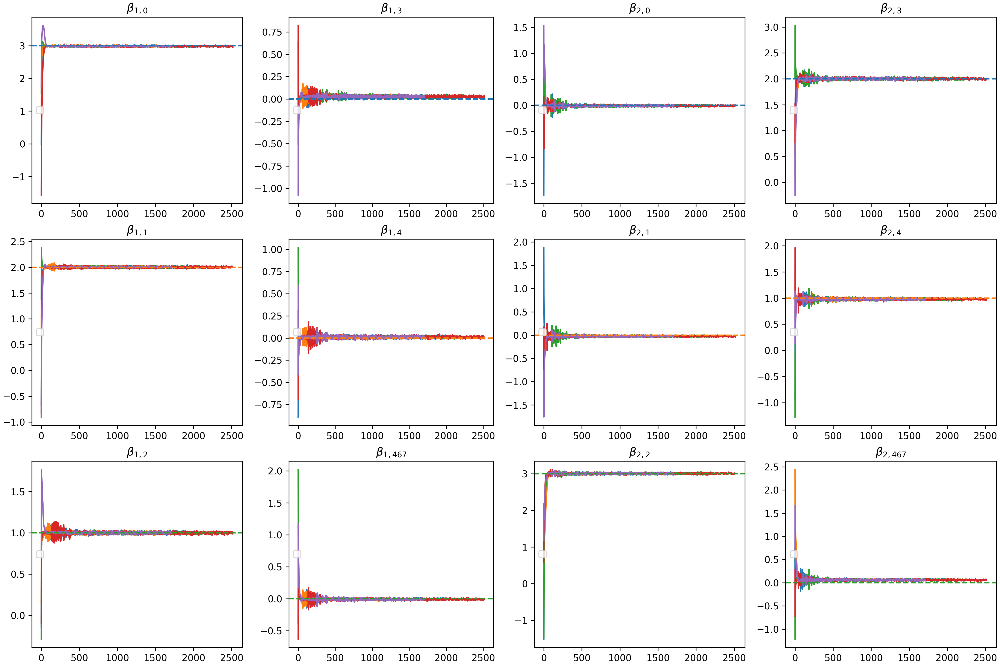

Detailed Example of Variable Selection Using sdg4varselect
==========================================================

This is an example on how sdg4varselect works on a pharmacodynamic model.

``sdg4varselect`` depends on ``jax`` library but also on ``parametrization_cookbook``. This is not mandatory but strongly recommended; all the examples will use a specific parametrization.

Let's start by importing all dependencies and the package::

    import numpy as np

    import jax.numpy as jnp
    import jax.random as jrd

    import functools
    from jax import jit

    import parametrization_cookbook.jax as pc
    import sdg4varselect.plotting as sdgplt

Mixed Effects Model Specification
---------------------------------

We consider in this example the two compartments pharmacodynamic model used by Pinheiro and Bates (2000). The observation :math:`Y_{i,j}` is the serum concentration measured at time :math:`t_{i,j}`. The model is given by:

.. math::

    Y_{ij} = \dfrac{D k_{ai}}{\mathcal V(k_{ai} - Cl_i)}
    \left( \exp\left(-\dfrac{Cl_i}{\mathcal V} t_{ij}\right) - \exp\left(-k_{ai} t_{ij}\right) \right) + \varepsilon_{ij}, ~
    \varepsilon_{ij} \sim \mathcal N(0, \sigma^2).

Where the individual’s parameters :math:`V_i` represents the distribution volume, :math:`k_{ai}` the absorption rate,  :math:`Cl_i`  the clearance and :math:`Cl_i/V_i` the elimination rate; :math:`D_i` is the known dose of the drug received by individual  :math:`i`.

Let us define the individuals parameter using covariates to explain the individual variability:

.. math::

    k_{ai} = \mu_1 +  X_i \beta_1+ \varphi_1,
    Cl_i= \mu_2 +  X_i \beta_2 + \varphi_2,

where

.. math::

    \varphi_i \sim \mathcal N_2\left(0,
    \begin{pmatrix}
    \omega_1^2 & 0 \\
    0 & \omega_2^2
    \end{pmatrix}
    \right),

We also define the non linear function :math:`m` that defines the mixed model:

.. math::

    m(t_{ij},V_i, k_{ai}, Cl_i) = \frac{D_i k_{ai}}{V_i(k_{ai} - Cl_i/V_i)} \left(\exp(-k_{ai}t_{ij}) - \exp\left(-\frac{Cl_i}{V_i}t_{ij}\right)\right).

We define this function in the following code::

    def m(params, times, D, V, ka, Cl, **kwargs):
        out = (
            D
            * ka[:, None]
            / (V * ka[:, None] - Cl[:, None])
            * (jnp.exp(-Cl[:, None] / V * times) - jnp.exp(-ka[:, None] * times))
        )

        assert out.shape == times.shape
        return out

Then, we define the individuals parameters with the function::

    def individual_parameters(self, params, **kwargs) -> jnp.ndarray:
        cov1 = kwargs["cov1"]
        cov2 = kwargs["cov2"]

        mean = jnp.array([params.mean_latent.mu1, params.mean_latent.mu2])
        return mean + jnp.array([cov1 @ params.beta1, cov2 @ params.beta2]).T

Model Definition
~~~~~~~~~~~~~~~~

We can now define our models as follows. We define a new python class inherited from the ``AbstractMixedEffectsModel`` class. This implements the minimal structure to define a model from only the function that we have just implemented.

We also want to define a high dimensional covariate model, we inherit from the ``AbstractHDModel`` class for this.

This model is defined with two individual parameters, so we specify them when initialising the class::

    from sdg4varselect.models import AbstractMixedEffectsModel, AbstractHDModel

    class PKMixedEffectsModel(AbstractMixedEffectsModel, AbstractHDModel):
        def __init__(self, N=1, P=1, **kwargs):
            AbstractHDModel.__init__(self, P=P)
            AbstractMixedEffectsModel.__init__(self, N=N, J=12, **kwargs)
            self.add_latent_variables("ka")
            self.add_latent_variables("Cl")

        @property
        def name(self):
            return f"PKMEM_N{self.N}_J{self.J}_P{self.P}"

        def init_parametrization(self):
            self._parametrization = pc.NamedTuple(
                mean_latent=pc.NamedTuple(
                    mu1=pc.Real(loc=10, scale=1),
                    mu2=pc.Real(loc=10, scale=1),
                ),
                cov_latent=pc.MatrixDiagPosDef(dim=2, scale=1),
                var_residual=pc.RealPositive(scale=0.01),
                beta1=pc.Real(scale=1, shape=(self.P // 2,)),
                beta2=pc.Real(scale=1, shape=(self.P // 2,)),
            )
            self.parametrization_size = self._parametrization.size

        # ============================================================== #
        @functools.partial(jit, static_argnums=0)
        def mixed_effect_function(self, params, *args, **kwargs) -> jnp.ndarray:
            return m(params, *args, **kwargs)

        # ============================================================== #
        @functools.partial(jit, static_argnums=0)
        def get_mean_latent(self, params, **kwargs) -> jnp.ndarray:
            return individual_parameters(self, params, **kwargs)

        # ============================================================== #

        def sample(self, params_star, prngkey, **kwargs):
            (prngkey_cov, prngkey_mem) = jrd.split(prngkey, num=2)

            time = jnp.array([0.05, 0.15, 0.25, 0.4, 0.5, 0.8, 1, 2, 7, 12, 24, 40])
            self._j = time.shape[0]
            time = jnp.tile(time, (self.N, 1))

            cov = jrd.bernoulli(prngkey_cov, p=0.2, shape=(self.N, self.P // 2))
            cov /= jnp.std(cov, axis=0)[None, :]
            cov -= jnp.mean(cov, axis=0)[None, :]

            obs, sim = AbstractMixedEffectsModel.sample(
                self,
                params_star,
                prngkey_mem,
                mem_obs_time=time,
                cov1=cov,
                cov2=cov[:, :],
            )

            return {"mem_obs_time": time, "cov1": cov, "cov2": cov[:, :]} | obs, sim

Data Generation
---------------

Let's generate a dataset with 300 individuals, and define the true values of the parameters::

    myModel = PKMixedEffectsModel(N=300, P=500 * 2, D=100, V=30)

    beta_star = (
        jnp.zeros(shape=(2, myModel.P // 2))
        .at[:, :5]  #
        .set([[3, 2, 1, 0, 0], [0, 0, 3, 2, 1]])  #
    )

    p_star = myModel.new_params(
        mean_latent={"mu1": 6, "mu2": 8},
        cov_latent=jnp.diag(jnp.array([0.2, 0.1])),
        var_residual=1e-3,
        beta1=beta_star[0, :],
        beta2=beta_star[1, :],
    )
    # Parameter names for future charts
    p_names = np.array(
        ["$\\mu_1$", "$\\mu_2$"]
        + [f"$\\omega^2_{{{i//(2)},{i%(2)}}}$" for i in range(2**2)]
        + ["$\\sigma^2$"]
        + [f"$\\beta_{{1,{i}}}$" for i in range(myModel.P // 2)]
        + [f"$\\beta_{{2,{i}}}$" for i in range(myModel.P // 2)],
    )

Then we can generate a data set::

    myobs, mysim = myModel.sample(p_star, jrd.PRNGKey(0))
    ax = sdgplt.ax(4, 7)
    ax.plot(myobs["mem_obs_time"].T, myobs["Y"].T, "o-")
    ax.set_title("Observed Serum Concentrations")
    ax.set_xlabel("Time (hours)")
    ax.set_ylabel("Concentration")

Variable Selection Procedure
----------------------------

In order to perform variable selection on the covariates and an estimation of the parameter, we use the Stochastic Proximal Gradient Descent using adaptive stepsize defined by the Adagrad algorithm::

    from sdg4varselect.algo import (
        preconditioner_factory,
        StochasticProximalGradientDescentPrecond as SPGD,
    )

    AdaGrad = preconditioner_factory("AdaGrad", scale=None, regularization=1e-8)

    algo = SPGD(AdaGrad, partial_fit=False, save_all=False)
    algo.init_mcmc(myModel, adaptative_sd=True)

    algo.max_iter = 5000
    algo.estimate_average_length = 1000

Selection Function
~~~~~~~~~~~~~~~~~~

We finally define a function which, for a random seed and a regularization value, performs a selection of the most relevant covariates and then a re-estimation in the model reduced to the selected covariates::

    def selection(algo, prngkey, model, data, lbd):
        prngkey_theta, prngkey_select = jrd.split(prngkey, 2)

        # drawing of a random initial value
        theta0 = jrd.normal(prngkey_theta, shape=(model.parametrization.size,))

        algo.set_seed(prngkey_select)
        algo.lbd = lbd  # set the regularization parameter
        out = algo.fit(model, data, theta0)

        return out

Regularization Path
~~~~~~~~~~~~~~~~~~~

We evaluate this function on a grid of regularization values using the function provided by the package. We thus construct a regularization path::

    from sdg4varselect._regularization_function import regularization_path

    regPath = regularization_path(
        selection,
        prngkey=jrd.PRNGKey(0),
        lbd_set=jnp.logspace(1.5, 2.6, num=10),
        algo=algo,
        model=myModel,
        data=myobs,
    )
    regPath.theta_star = p_star

    fig = sdgplt.figure(6, 6)
    fig = sdgplt.plot_regpath(regPath.standardize(), P=myModel.P, fig=fig)
    _ = fig.axes[1].legend(loc="best")

Extracting Selected Variables
~~~~~~~~~~~~~~~~~~~~~~~~~~~~~

We extract the values from the regression vector :math:`(\beta_1, \beta_2)` then we check the variables that were selected::

    beta_estim = regPath.last_theta[jnp.argmin(regPath.ebic), -myModel.P :]
    print(f"number of selected variables: {jnp.sum(beta_estim != 0)}")
    print(f"non zero coefficients: {beta_estim[beta_estim != 0]}")

.. code-block:: text

    number of selected variables: 7
    non zero coefficients: [2.76353115e+00 1.78738583e+00 7.82655257e-01 2.89870203e+00
     1.90075391e+00 8.74456940e-01 5.55777709e-08]

The non-zero parameters are well selected in addition to one component, but whose estimate is very low. In this situation, we advise refining the regularization grid in order to find a smaller value of the eBic.

Reestimation in the Reduced Model
---------------------------------

We can now reduce the model by selecting variables and making an estimation in the reduced model::

    supp = jnp.where(beta_estim != 0)[0]
    supp = jnp.unique(supp - jnp.zeros_like(supp).at[3:].set(500))
    print(f"The indices of the selected covariates are: {supp}")
    myobs["cov1"] = myobs["cov1"][:, supp]
    myobs["cov2"] = myobs["cov2"][:, supp]
    myReducedModel = PKMixedEffectsModel(N=300, P=len(supp) * 2, D=100, V=30)

    p_names = np.array(
        ["$\\mu_1$", "$\\mu_2$"]
        + [f"$\\omega^2_{{{i//(2)},{i%(2)}}}$" for i in range(2**2)]
        + ["$\\sigma^2$"]
        + [f"$\\beta_{{1,{i}}}$" for i in supp]
        + [f"$\\beta_{{2,{i}}}$" for i in supp],
    )

.. code-block:: text

    The indices of the selected covariates are: [  0   1   2   3   4 467]

.. code-block::

    AdaGrad = preconditioner_factory("AdaGrad", scale=None, regularization=1e-8)

    algo = SPGD(AdaGrad, partial_fit=False)
    algo.init_mcmc(myReducedModel, adaptative_sd=True)

    algo.max_iter = 5000
    algo.estimate_average_length = 4000

    def estimation(algo, prngkey, model, data):
        prngkey_theta, prngkey_estim = jrd.split(prngkey, 2)

        # drawing of a random initial value
        theta0 = jrd.normal(prngkey_theta, shape=(model.parametrization.size,))

        algo.set_seed(prngkey_estim)
        algo.lbd = None  # unset the regularization parameter for un penalized estimation
        return algo.fit(model, data, theta0)

To plot the estimates during the iterations, we need to enable saving of all algorithm data::

    algo.save_all = True

    from sdg4varselect.outputs import MultiGDResults

    allEstim = MultiGDResults(
        results=[estimation(algo, jrd.PRNGKey(i), myReducedModel, myobs) for i in range(5)]
    )
    allEstim.theta_star = myReducedModel.new_params(
        mean_latent={"mu1": 6, "mu2": 8},
        cov_latent=jnp.diag(jnp.array([0.2, 0.1])),
        var_residual=1e-3,
        beta1=beta_star[0, supp],
        beta2=beta_star[1, supp],
    )

We can observe and verify the good convergence of the algorithm::

    fig = sdgplt.figure(5, 15)
    _ = sdgplt.plot_theta(
        allEstim,
        fig=[*fig.subfigures(1, 2)],
        params_names=p_names,
        id_to_plot=[
            [0, 1, 6],
            [2, 5],  # 3, 4,
        ],
        log_scale=False,
    )

And finally, we can observe the estimation of the high dimensional parameters::

    fig = sdgplt.figure(10, 15)
    _ = sdgplt.plot_theta(
        allEstim,
        fig=[*fig.subfigures(1, 4)],
        params_names=p_names,
        id_to_plot=[
            [7, 8, 9],
            [10, 11, 12],
            [13, 14, 15],
            [16, 17, 18],
        ],
        log_scale=False,
    )

